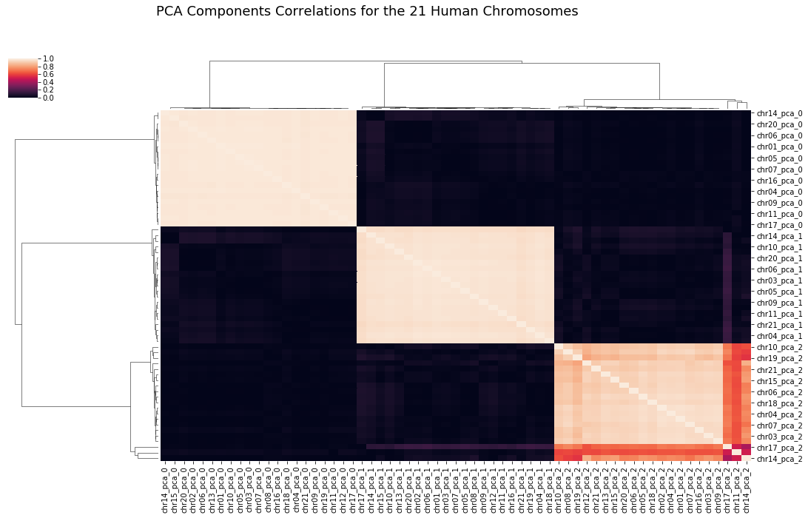
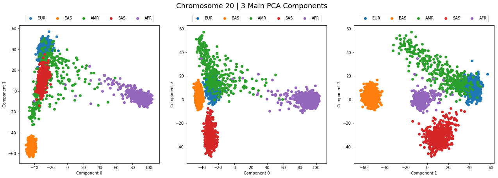
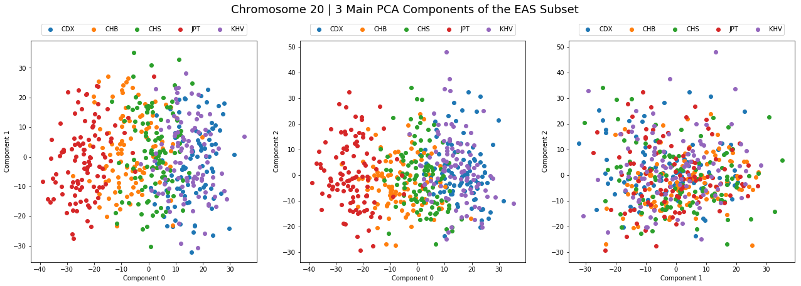
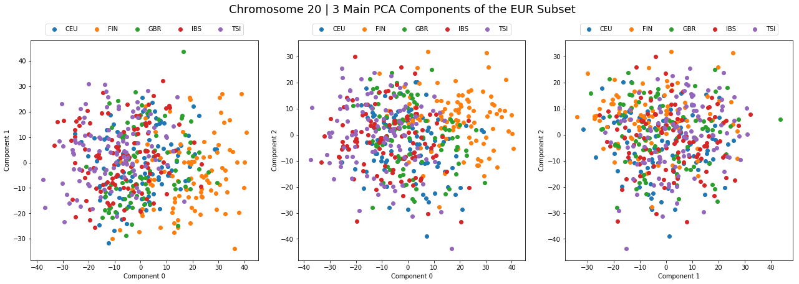

# Infering Geographic Origin from Genotype

`Authors: Meryll Dindin and Thomas Galeon`

## INTRODUCTION

Analyzing the genetic structure of human populations is key for designing novel therapies. Next generation sequencing (NGS) has enabled the sequencing a large number of individuals in distinct populations. The 1000 Genomes Project has identified over 84.4 million variants such as single nucleotide polymorphisms, insertions/deletions as well as structural variations. Mutations fuel population variability and can increase the fitness of individuals. Beneficial mutations can spread across a population through reproduction. As such, specific variants can act as markers of a certain population [1]. Principal component analysis has been used to infer geographic origin of individuals based on their genetic profile [2] [3] [4].Genetic similarities could also be traced back to historical exchanges between populations during events such as migration. Here we use principal component analysis (PCA) on the 1000 Genomes dataset to investigate some of the genetic exchanges that occurred in the last millenary.

## MATERIAL AND METHODS

**The 1000 Genomes Dataset** - We analyzed the latest release of the 1000 Genomes phase 3 dataset phase [5] which includes 84.4 million variants across 2,503 individuals representing 26 populations worldwide. The variants are split by chromosome and provided in the variant call format (VCF). For each individual, the allele present at any given position was provided. To efficiently process the data and speed up numerical computation we reduced the genotype information to a binary value: 0 if the allele was identical to the reference allele, 1 otherwise. Combining this with an Hadoop structure (Apache Parquet), we were able to reduce file size by a factor of 21.5. This structure also has the advantage of being columnar, allowing us to restrict our study to batches of individuals. This is a useful resource during prototyping. A quick exploratory data analysis made us reconsider the analysis of the sex chromosomes, as those have their own specificities. An example of that is the Y chromosome, that is processed in a whole different way compared to the other chromosomes, since it has only one allele to be mutated. We represented them in appendix.

**Incremental Principal Component Analysis** - Despite the significant file compression, each chromosome VCF file was too large to fit in memory on our servers. We therefore used incremental principal component analysis (IPCA). IPCA builds a low-rank approximation of the data using a fixed amount of memory. We applied IPCA on all VCF files for the human chromosomes in the 1000 Genomes dataset. We then restricted our analysis to the first 3 principal components and observed the spatial distribution of populations. We then repeated the process by narrowing down our analysis to the 5 super populations present in the dataset: Africa, America, East Asia, South Asia and Europe.

## RESULTS AND DISCUSSION

**Worldwide analysis** - We computed the IPCA for each chromosome using the complete 1000 Genomes dataset. We then plotted the hierarchical clustering of the correlations of the three main PCA components between the 21 chromosomes of the human species. We obtained a key result: all 3D representations were similar. We quantified the patterns we observed through correlations. The two first PCA components are highly (> 0.95 Pearson coefficient) correlated together, while the third ones are more variable (Figure 1). This phenomenon could be explained by similar mutation patterns intra-continents for all the chromosomes. The resulting clustering, as presented below, then result from the independence of those mutation patterns extra-continents. Finally, this analysis gives us a slight confirmation that the pattern extracted from the analysis of one specific chromosome could potentially be extended to any of the other chromosome. Unlike other results [2], Figure 2 does not bear much resemblance to a geographical map. However, there is a clear distinction between clusters from different geographical regions. The distinction was achieved despite the top 3 components accounting for less than 12% of the whole variance (Table 1). Although most papers only represent the two main PCA components, we extended the analysis to three, as 3D visualizations provide a better distinction of clusters. Europe seems to bear the most resemblance with other continents. The distinction with Africa is made essentially along PC1 and that with Asia along PC0. South Asia appears more distant to Europe than East Asia which is in agreement with both the geography and the history of these populations. Interestingly, American populations do not appear as a single cluster and seem more diffuse. Historically this makes sense: most of America’s population comes from immigration, whether it be from Europe, Africa or Asia.

**Continental analysis** - The PCA mapping obtained at a continental level was less striking in its partitioning of populations than our worldwide analysis. Indeed, clusters are visible using the first two principal components yet they are more diffuse than in the previous mapping Figure 3 and Figure 4. This was the case for all 5 super populations explored. One explanation is the limited number of samples within each super population. This makes extraction of principal components harder. Other papers differentiating population structure using PCA in Europe used a dataset 6 times as large [2]. In addition, current sequencing techniques tend to underestimate low frequency alleles. These correspond to more recent mutations why may differentiate populations in close proximity.

## CONCLUSION

Our work shows how geographic origins can be traced back to genetic mutations. To further enhance the correspondence between our PCA mapping and geographic origins we could use Procrustes analysis as suggested by [3]
These results could play an important role in population genetic studies and shed light on some of the original migration events that occurred in the past.

## References

* [1] L. Loewe and W. G. Hill, "The population genetics of mutations: good, bad and indifferent," Philosophical Transactions B, vol. 365, no. 1544, p. 1153–1167, 2010. 
* [2] J. Novembre, T. Johnson, K. Bryc, Z. Kutalik, A. R. Boyko, A. Auton, A. Indap, K. S. King, S. Bergmann, M. R. Nelson, M. Stephens and C. D. Bustamante, "Genes mirror geography within Europe," Nature, vol. 456, pp. 98-101, 2008. 
* [3] C. Wang, S. Zöllner and N. A. Rosenberg, "A Quantitative Comparison of the Similarity between Genes and Geography in Worldwide Human Populations," PLOS Genetics, vol. 8, no. 8, 2012. 
* [4] D. Lu and S. Xu, "Lu D, Xu S. Principal component analysis reveals the 1000 Genomes Project does not sufficiently cover the human genetic diversity in Asia. Front Genet. 2013;4:127. Published 2013 Jul 4. doi:10.3389/fgene.2013.00127," Frontiers in Genetics, vol. 4, no. 27, 2013. 
* [5] IGSR, "IGSR: The Internation Genome Sample Resource," 2013. [Online]. Available: http://www.internationalgenome.org/. [Accessed 10 May 2019].
